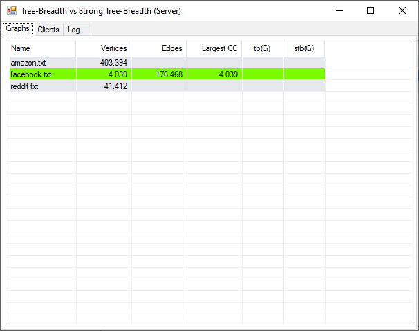
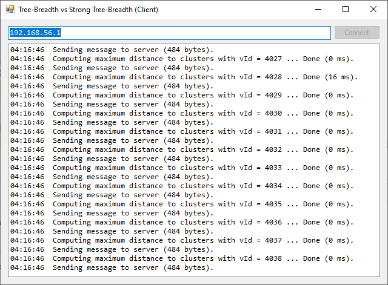

# Tree-Breadth vs. Strong Tree-Breadth

## Motivation and Goal

In simple terms, the *tree-breadth* of a graph *G* (written as tb(*G*)) states how close *G* is to a tree from a metric perspective.
*Strong tree-breadth*  (written as stb(*G*)) follows the same idea, but it has some additional restrictions.
It follows from their respective definitions that tb(*G*) ≤ stb(*G*) for each graph *G*.
We currently do not know whether or not a limit on tree-breadth implies a limit on the strong tree-breadth of a graph.
That is, we do not know if there isa constant *c* such that stb(*G*) ≤ *c* · tb(*G*) for each graph *G*.
Recent results [2] suggest that such a boundary exits.

Although determining either parameter for a given graph is NP-complete, it is possible to estimate both parameters:
A layering partition gives an upper bound of the tree-breadth of a graph [1].
Additionally, there is a polynomial algorithm that, if a given graph *G* has strong tree-breath *ρ*, computes a tree-decomposition for *G* withn (weak) tree-breadth at most *ρ* [3].

For this project, Holly implemented the algorithms mentioned above.
I then embedded her implementation into a server-client application that allows us to process both parameters on large graphs in parallel using multiple computers in a network.
Our goal was to run them on various real-life net-works.
The results might disprove some conjectures or give other indications for future theoretical research.

[[1]](https://doi.org/10.1007/s00453-013-9765-4)
F. Dragan, E. Köhler:
An Approximation Algorithm for the Tree t-Spanner Problem on Unweighted Graphs via Generalized Chordal Graphs.
*Algorithmica* 69 (4), 884-905, 2014.

[[2]](https://doi.org/10.1016/j.dam.2019.02.009)
G. Ducoffe, A. Leitert:
Equivalence Between Pathbreadth and Strong Pathbreadth.
*Discrete Applied Mathematics* 262, 185-188, 2019.

[[3]](https://doi.org/10.1007/978-3-319-48749-6_5)
A. Leitert, F. Dragan:
On Strong Tree-Breadth.
COCOA 2016, *Lecture Notes in Computer Science* 10043, 62-76, 2016.

## Programs

The project contains three programs:

  - **Server.**
    The server coordinates the clients and combines their partial results into the overall result.
    It is written in C#.

    

  - **Client.**
    The client communicates with the server and computes what the server asks for.
    The computation of potential partners (to estimate strong tree-breadth) is forwarded to the according program (see below).
    Requests and results are communicated via standard-input and -output.
    The client is written in C#.

    

  - **Potential Partners** (written by Holly)**.**
    The program computes, for a given graph *G* and vertex *v*, the potential partners of *v* in *G*.
    Results are read by the client and then send to the server.
    The program is written in C++.
